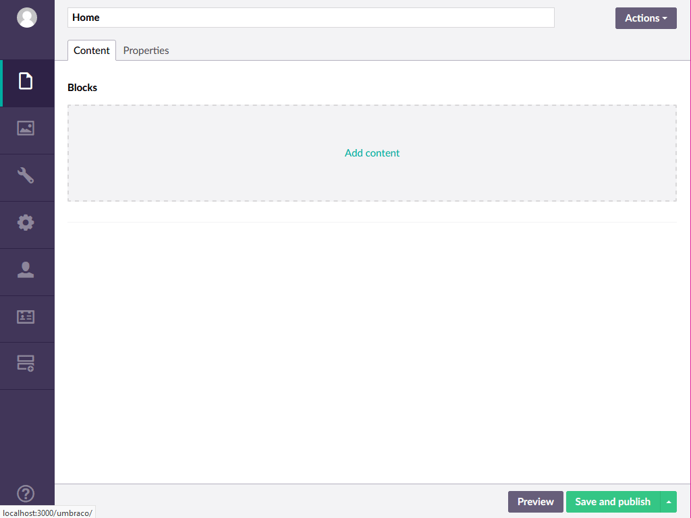

# Umbraco Embedded Content

[](https://www.nuget.org/packages/DisPlay.Umbraco.EmbeddedContent)

An Umbraco property that uses document types for content blocks.




> *Note:*  Embedded Content works with **Umbraco 7.6.0** and newer


## Installation

Embedded Content is available as a NuGet [package](https://www.nuget.org/packages/DisPlay.Umbraco.EmbeddedContent).

To install run the following command in the [Package Manager Console](https://docs.nuget.org/docs/start-here/using-the-package-manager-console)

```powershell
PM> Install-Package DisPlay.Umbraco.EmbeddedContent
```

## Usage

For now look at the sample project in `samples/Website`

## Label resolvers

Out of the box the following property editors have custom label resolvers:

| Property editor alias         | Displayed value                       |
| ----------------------------- | ------------------------------------- |
| Umbraco.MultipleMediaPicker   | Comma separated list of media names   |
| Umbraco.MediaPicker2          | Comma separated list of media names   |
| Umbraco.MultiNodeTreePicker   | Comma separated list of entity names  |
| Umbraco.MultiNodeTreePicker2  | Comma separated list of entity names  |
| Umbraco.TinyMCEv3             | Text without HTML                     |
| UmbracoForms.FormPicker       | Form name                             |
| RJP.MultiUrlPicker            | Comma separated list of link names    |

Property editors without a label resolver shows the raw value.

### Creating a custom label resolver
```javascript
angular.module('umbraco')
.run(['DisPlay.Umbraco.EmbeddedContent.LabelResolvers', 'formResource', (labelResolvers, formResource) => {
  labelResolvers['UmbracoForms.FormPicker'] = (property, cacheService) => {
    const fromCache = cacheService.getOrAdd('UmbracoForms.FormPicker', property.value, () => {
      return formResource.getByGuid(property.value);
    });

    return fromCache ? fromCache.data.name : null;
  }
}]);
```

## Contributing

Anyone can help make this project better - check out our [Contributing guide](CONTRIBUTING.md)

## Authors

 * [Rasmus John Pedersen](https://www.github.com/rasmusjp)

## License

Copyright © 2016 DIS/PLAY A/S

Embedded Content is released under the [MIT License](LICENSE)
